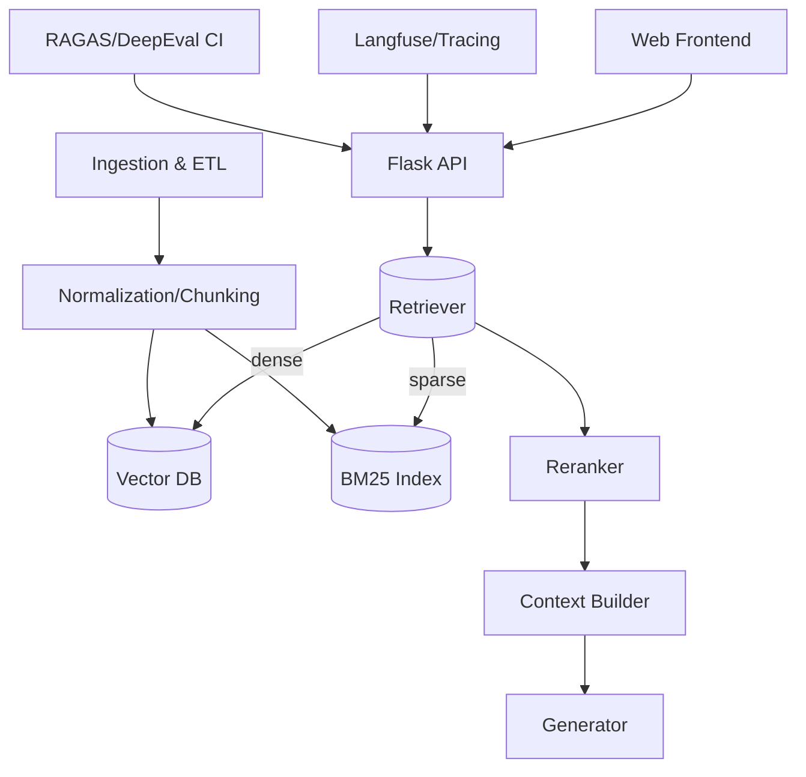

# PRD: JuSimples RAG v2

## Summary
Build a reliable PT‑BR legal assistant with trustworthy retrieval (laws, jurisprudence, DOU) and cited answers.

## Goals
- High‑precision answers with citations to authoritative sources.
- Low latency (< 2s p95 for common queries) and predictable costs.
- Transparent observability and continuous evaluation.

## Non‑Goals
- End‑to‑end legal automation or document filing.
- Predictive outcomes beyond retrieval‑grounded guidance.

## Personas
- Citizen seeking guidance.
- Paralegal/attorney needing quick references.

## Functional Requirements
- Ingest and normalize laws (LexML/Senado/Câmara), jurisprudence (DataJud/tribunais), and DOU.
- Semantic + hybrid retrieval over chunked corpora.
- Reranking and citation‑first answer generation.
- Admin dashboard for health, evals, and KB insights.

## Non‑Functional Requirements
- LGPD compliance, audit logs, PII handling.
- Observability (traces, costs, latency), error budgets.
- Rollback/feature flags for retrieval pipeline.

## Architecture

## Milestones
- M1: Current state docs + PRD (this doc) – complete
- M2: MVP retrieval: embeddings + pgvector; basic ingestion pipeline; `/api/ask` uses semantic search
- M3: Observability (Langfuse) + nightly evals (RAGAS); admin surfacing
- M4: Hybrid retrieval (BM25) + reranker (Jina v2 lite)
- M5: Expand ingestion (LexML/DataJud/DOU) + schema conformance
- M6: Hardening: caching, rate limiting, PII redaction, model/versioning
- M7: Beta release + KPI review

## KPIs
- Retrieval Hit@k (k=10) ≥ 0.8 on gold set
- Answer Faithfulness ≥ 0.9; Hallucination rate ≤ 5%
- Latency p95 ≤ 2s; Availability ≥ 99.5%
- Cost per 100 queries within budget (target set by ops)

## Risks & Mitigations
- Source instability → multi‑source ingestion + retries + monitoring
- Cost overruns → caching, smaller models, rerank lite, eval‑gated rollouts
- Data quality → schema validation, dedup, audits

## Rollout & Ops
- Feature flag new retriever components, A/B test vs keyword baseline.
- CI: fail deploy if eval metrics regress beyond thresholds.
- Instrument prompts and token costs; weekly dashboards.

## Open Questions
- Which vector DB path (pgvector vs Qdrant vs Pinecone) after MVP load tests?
- Jurisprudence coverage prioritization (STF/STJ vs regionals).
