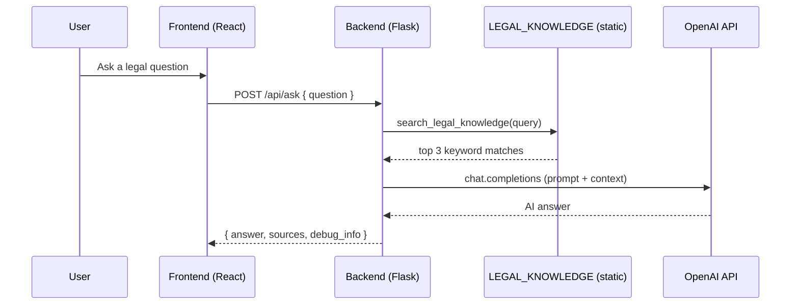

# JuSimples RAG – Current System (v2.5.0)

This document maps the current RAG pipeline implemented in `backend/app.py` and related modules.

## Components

- __Backend API__: Flask app in `backend/app.py`
- __Admin Dashboard__: Flask blueprint in `backend/admin_dashboard.py`
- __Static KB__: `LEGAL_KNOWLEDGE` array in `backend/app.py`
- __Search__: `search_legal_knowledge(query)` keyword matching
- __Generation__: `generate_ai_response(question, context)` via OpenAI Chat Completions
- __Data ingestion (planned)__: `backend/data_collector.py` using `backend/lexml_scraper.py`

## Key Endpoints (backend/app.py)
- `GET /` – service info
- `GET /health`, `GET /api/health` – health checks
- `POST /api/ask` – main QA path
- `POST /api/search` – keyword search only
- `POST /api/test-rag` – admin test path
- `POST /api/switch-model` – change `OPENAI_MODEL` at runtime
- `GET /api/debug` – status and config

## Environment
- `OPENAI_API_KEY` – required. Currently missing/invalid in deployment.
- `OPENAI_MODEL` – default `gpt-5-nano` (falls back to `gpt-4o-mini` when tested)
- `CORS_ORIGINS` – default allows localhost and Netlify frontends

## Sequence Diagram

## Runtime Flow
1. __Input validation__: `ask_question()` checks emptiness and minimum length.
2. __Retrieval__: `search_legal_knowledge()` iterates `LEGAL_KNOWLEDGE` and scores by keyword overlap; returns top 3.
3. __Prompting__: `generate_ai_response()` builds a PT‑BR instruction prompt, concatenating the matched docs.
4. __Model Call__: `OpenAI.chat.completions.create(model=OPENAI_MODEL, ...)`.
5. __Response__: Returns `answer`, `sources` (document previews), and `debug_info`.

## Current Limitations
- __No embeddings/vector store__: Retrieval is keyword‑only.
- __Tiny KB__: 5 demo entries.
- __Key management__: `OPENAI_API_KEY` not set in deployment; causes generation failures.
- __No evals/observability__: No systematic metrics or tracing.

## Related Modules
- `backend/admin_dashboard.py`: health, env vars, KB viewer, RAG test.
- `backend/data_collector.py`: orchestrates scraping and JSON persist.
- `backend/lexml_scraper.py`: scrapes LexML and official sources with BeautifulSoup.

## Planned Upgrades
- Replace keyword search with semantic retrieval (embeddings + vector DB).
- Add hybrid retrieval (dense + sparse/BM25) and reranking.
- Add evals (RAGAS/DeepEval) and observability (Langfuse).
- Expand ingestion via LexML/DataJud/DOU and normalize into a target schema.
